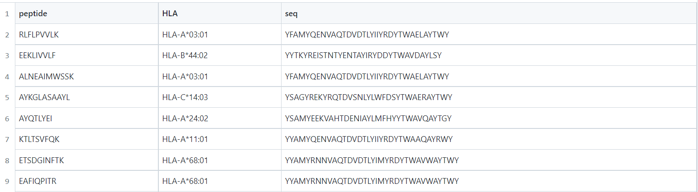
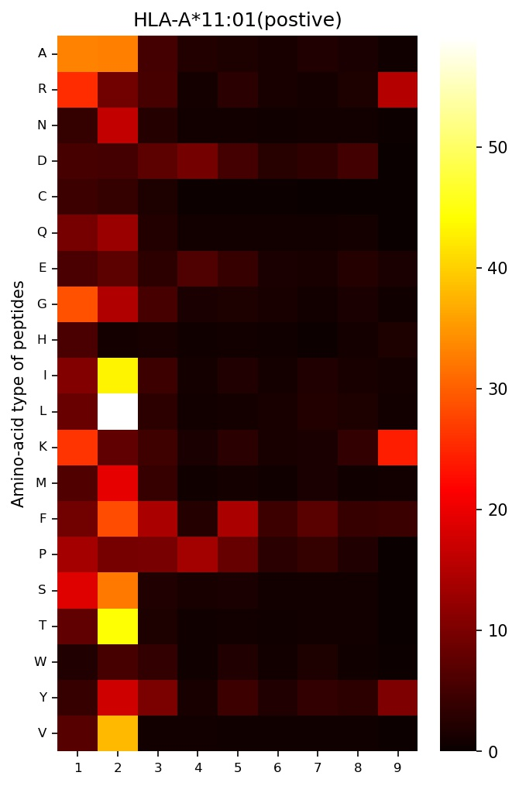
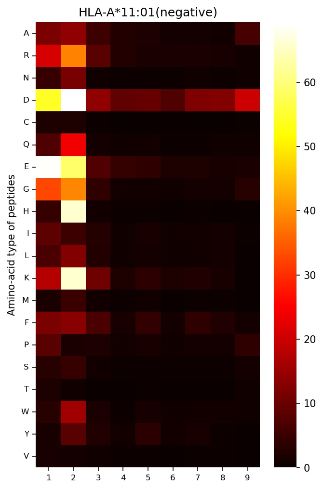
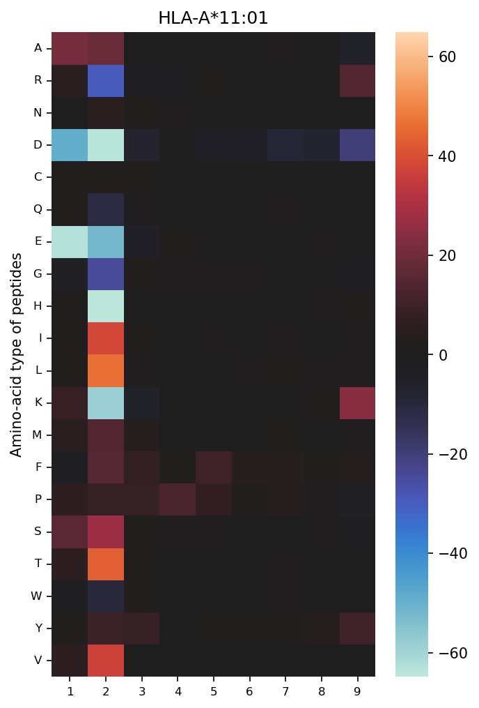

# APPDFT

_ _  _ _

# An antigen presentation prediction method based on data fusion and transformer

_ _ _ _

## 1.  Dependencies

python(version=3.7.9); pytorch(version=1.8.0)；pandas(version=1.2.4); numpy(version=1.18.5); tqdm(version=4.56.0); matplotlib(version=3.3.2); seaborn(version=0.11.1)

## 2. Tutorial

### 2.1 Prediction Demo

- Organize your input information in the following format:
  
  

- Run the command to make a prediction：
  
  ```console
  python APPDFT.py --input test.csv --output output.csv
  ```

- input.csv: the first column is the sequence of the peptide, the second column is the name of the HLA, and the third column is the pseudo-sequence of the HLA

- output.csv: the path where you want to save the prediction results

### 2.2 Immune Epitope Motif Demo

- Run the command to obtain the immune epitope motif for the specified HLA：
  
  ```console
  python APPDFT_motif.py --MHC HLA-A*11:01 --MHCseq YYAMYQENVAQTDVDTLYIIYRDYTWAAQAYRWY
  ```

- MHC: the name of the MHC molecule

- MHCseq: the pseudo-sequence of the MHC molecule

- Three heatmaps are generated at the end of the program, which can reflect the specified HLA immune epitope pattern:
  
  